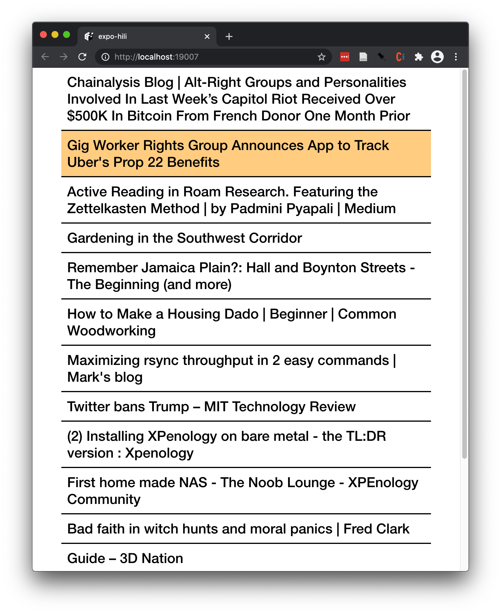
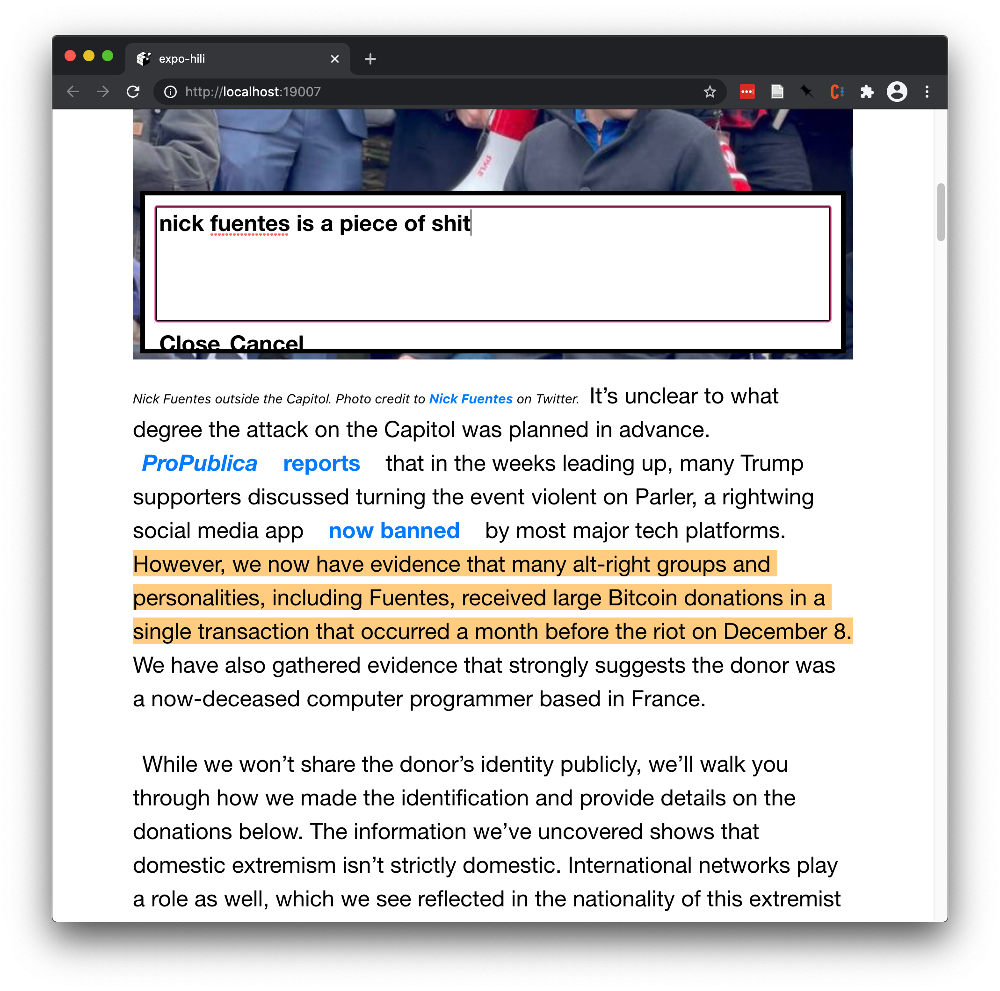
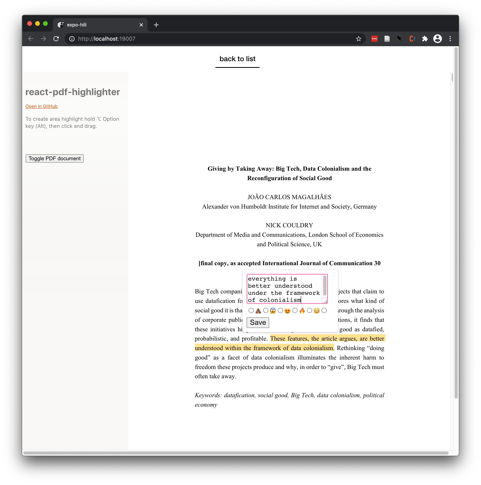

# hiboard

hiboard is an article reader and highlighting tool for materials saved on pinboard. It uses
[readability](https://github.com/mozilla/readability) to render articles, and pdf.js to render PDFs.
It supports highlighting and sending text to a server endpoint using JSON.

I made this because I didn't have a good reader that supported **both** articles and PDFs, and I
wanted a way to control where my highlights ended up, and what they looked like. Some tools allow
tags, some just freeform notes, but I wanted to be able to choose.

## Screenshots and features

Hiboard has a minimal article list after pasting your pinboard API token into the landing page:

Once you click on an article, you enter a nice reading mode:

When you make a highlight in an article, you're prompted to add notes. This is just freeform text:

You can also read and make highlights in PDFs you've saved to pinboard:

## To-Do:

- support more kinds of annotations in PDFs
- integrate a server into the app for usability and testing
- allow editing notes once created
- helpful keybinds while creating notes and reading
- figure out why including and renderind pdfs is so fucking hard

## Dev Notes

in pdfjs-dist, you need to replace the `optionalContentConfig` line with null (better
description here in the future).
